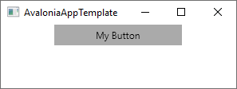
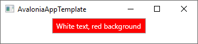

Title: Button
---
The `Button` control is a [`ContentControl`](contentcontrol) which reacts to pointer presses.

A button notifies clicks by raising the [`Click`](/api/Avalonia.Controls/Button/61B1E7A8) event.
A click is distinct from a `PointerDown` event in that it is raised by default when the button is
pressed and then released (although this behavior can be changed by setting the 
[`ClickMode`](/api/Avalonia.Controls/Button/7B4CADF5) property).

Alternatively an instance of [`ICommand`](https://docs.microsoft.com/en-gb/dotnet/api/system.windows.input.icommand?view=netstandard-2.0)
can be assigned or bound to the button's [`Command`](/api/Avalonia.Controls/Button/4AAA993D)
property. This command will be executed when the button is clicked. For more information see
[binding to commands](/docs/binding/binding-to-commands.md).

# Common Properties

|Property|Description|
|--------|-----------|
|`ClickMode`|Describes how the button should react to clicks|
|`Command`|A command to be invoked when the button is clicked|
|`CommandParameter`|A parameter to be passed to `Command`|
|`Content`|The content to display in the button|
|`IsDefault`|When set, pressing the enter key clicks the button even if not focused|
|`IsPressed`|Set when the button is depressed|

# Pseudoclasses

|Pseudoclass|Description|
|-----------|-----------|
|`:pressed`|Set when the button is depressed|

# Source code
[Button.cs](https://github.com/AvaloniaUI/Avalonia/blob/master/src/Avalonia.Controls/Button.cs)

# Examples

 ## Basic button
```xml
<Window xmlns="https://github.com/avaloniaui"
        xmlns:x="http://schemas.microsoft.com/winfx/2006/xaml"
        xmlns:d="http://schemas.microsoft.com/expression/blend/2008"
        xmlns:mc="http://schemas.openxmlformats.org/markup-compatibility/2006"
        mc:Ignorable="d" d:DesignWidth="800" d:DesignHeight="450"
        x:Class="AvaloniaAppTemplate.MainWindow"
        Title="AvaloniaAppTemplate">
	<StackPanel>
		<Button Width="160" >My Button</Button>
	</StackPanel>
</Window>
```
produces following output with **Windows 10**  


 ## Colored button
```xml
<Window xmlns="https://github.com/avaloniaui"
        xmlns:x="http://schemas.microsoft.com/winfx/2006/xaml"
        xmlns:d="http://schemas.microsoft.com/expression/blend/2008"
        xmlns:mc="http://schemas.openxmlformats.org/markup-compatibility/2006"
        mc:Ignorable="d" d:DesignWidth="800" d:DesignHeight="450"
        x:Class="AvaloniaAppTemplate.MainWindow"
        Title="AvaloniaAppTemplate">
	<StackPanel>
		<Button Width="160" Foreground="White" Background="Red">White text, red background</Button>
	</StackPanel>
</Window>
```
produces following output with **Windows 10**  
