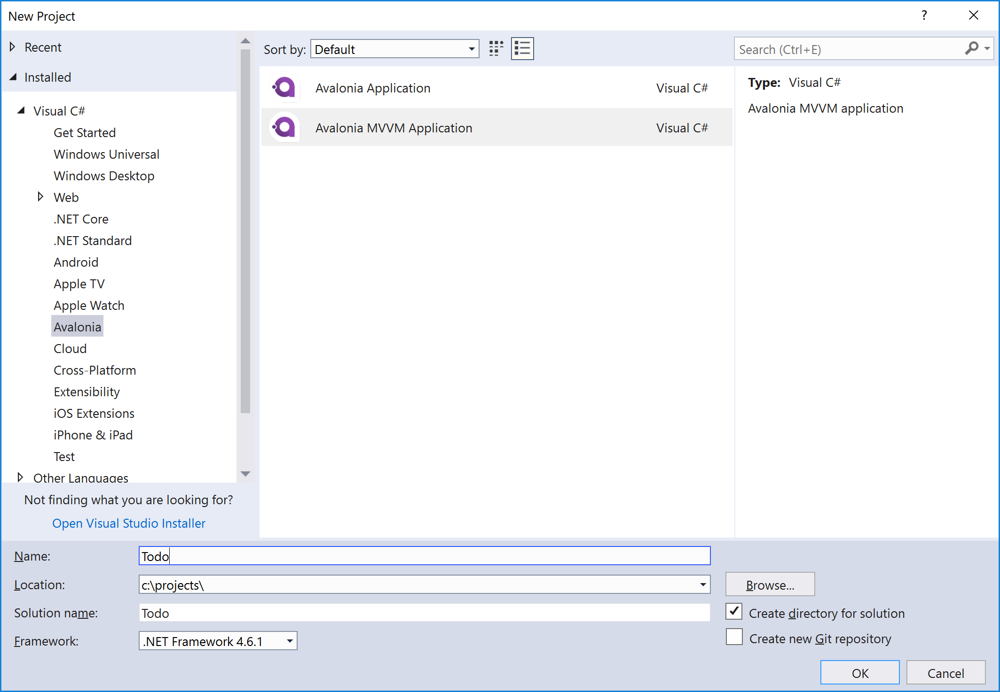

Title: Creating the Project
Order: 10
---

<ul class="nav nav-tabs platform-choice">
	<li class="active"><a  href="#vs" data-toggle="tab">Visual Studio</a></li>
	<li><a href="#netcore" data-toggle="tab">.NET Core</a></li>
</ul>

<div class="tab-content platform-choice clearfix">
  <div class="tab-pane active" id="vs">

The easiest way to get started with Avalonia from Visual Studio is to
[install the extension](https://marketplace.visualstudio.com/items?itemName=AvaloniaTeam.AvaloniaforVisualStudio)
from the Visual Studio Marketplace. Once that is installed, you can create an Avalonia MVVM application:



1. Start Visual Studio
2. Select "Create a new project" from the start window or `File -> New -> Project` from the main menu
3. Search for "Avalonia" and select "Avalonia MVVM Application"
4. Click "Next"
5. Enter "Todo" as the Project name
6. Click "Create"

:::note
The "Framework" selection can be ignored here - it doesn't have any effect on this template.
:::

  </div>
  <div class="tab-pane" id="netcore">

First install the Avalonia templates for .NET Core by following the instructions
[here](https://github.com/AvaloniaUI/avalonia-dotnet-templates).

Now you can create the application from the template:

```powershell
dotnet new avalonia.mvvm -o Todo -n Todo
```

  </div>
</div>


## Project structure

The newly created project will be pre-filled with a number of files and directories:

```
Todo
 |- App.xaml
 |- App.xaml.cs
 |- Assets
 |   |- avalonia-logo.ico
 |- Models 
 |- nuget.config 
 |- Program.cs
 |- Todo.csproj
 |- ViewLocator.cs
 |- ViewModels
 |   |- MainWindowViewModel.cs
 |   |- ViewModelBase.cs
 |- Views
 |   |- MainWindow.xaml
 |   |- MainWindow.xaml.cs
```

You can see there are directories for each of the concepts in the MVVM pattern (models, views and view models) as well as couple of other files and directories:

- The **Assets** directory holds the binary assets for your application such as icons and bitmaps. Files placed in this directory will automatically be included as resources in the application.
- The **Models** directory is currently empty, but as the name suggests this is where we'll be putting our models.
- The **ViewModels** directory is pre-filled with a base class for view models and a view model for the application main window.
- The **Views** directory just contains the application main window for now.
- The **App.xaml** file is where XAML styles and templates that will apply to the entire application will be placed.
- The **Program.cs** file is the entry point for execution of the application. Here you can configure the platform options for Avalonia if necessary.
- The **ViewLocator.cs** file is used to look up views for view models. This will be explained in more detail later.

<a class="btn btn-primary" role="button" href="creating-a-view">
    Next
</a>